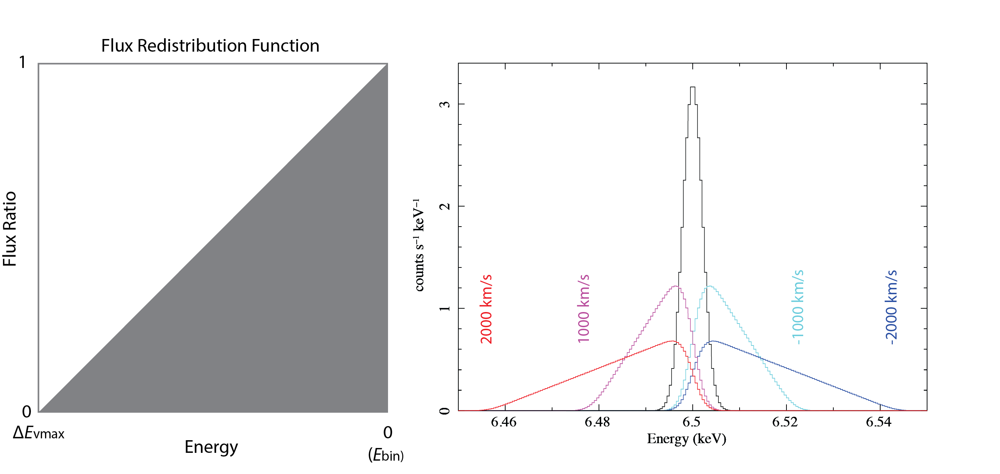
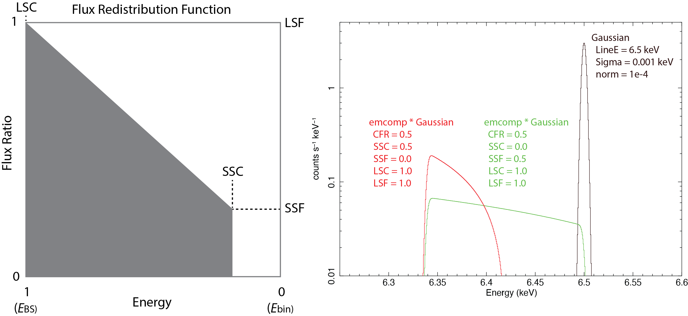

# Redistribution Models: htsmooth (asymmetric broadening function) and emcomp (empirical function that reproduces a Compton scattering profile)


## Preface

These two convolution models empirically reproduce asymmetrically broadened or Compton down-scattered spectra.
They use the _calcManyLines_ generic code in _Xspec_, which is used in the _gsmooth_ function and other smoothing functions, and is provided as calcLinesLM.cxx in this distribution.


## Model: htsmooth

The **htsmooth** (Half-Triangle SMOOTH) model redistributes the flux within each spectral bin (Ebin) to a half-triangular distribution. The model includes a single parameter, MaxVel, in units of km/s, which represents the maximum absolute radial velocity at the end of the half-triangle. A negative MaxVel value indicates a blueshift, while a positive value indicates a redshift, extending the triangle into the higher- or lower-energy range, respectively.

| Parameter       | Units  | Description |
| --------------- | ------ | --------- |
| MaxVel | km/s | maximum absolute radial velocity at the end of the half-triangle |

In the following figure, the left panel shows the redistribution function of the **htsmooth** model. The corresponding energy of the free model parameter, vmax, is indicated on the panel. The right panel shows the function applied to a Gaussian line at 6.5 keV convolved with a XRISM _Resolve_ Hp spectral response. The MaxVel parameter for each model is displayed in its designated color.




## Model: emcomp

The **emcomp** (EMpirical COMPton) model redistributes the flux within each spectral bin (Ebin) to a trapezoidal distribution, defined down to the 180-degree Compton backscattering energy (_E_<sub>BS</sub>) using the Smallest Scattering Cut (SSC), Smallest Scattering Fraction (SSF), Largest Scattering Cut (LSC), and Largest Scattering Fraction (LSF). The 180-degree Compton backscattering energy (_E_<sub>BS</sub>) is:

$$E_{\rm BS} = \frac{E_{\rm bin}}{1+2(E_{\rm bin}/511~{\rm keV})}$$

The Compton Flux Ratio (CFR) parameter is the ratio of the Compton-scattering flux to the source flux.

| Parameter  | Description |
| ---------- | ----------- |
| CompFluxR  | Compton Flux Ratio (CFR) - ratio of the Compton-scattering flux to the source flux. |
| SmScatCut  | Smallest Scattering Cut (SSC) |
| SmScatFrac | Smallest Scattering Fraction (SSF) |
| LgScatCut  | Largest Scattering Cut (LSC) |
| LgScatFrac | Largest Scattering Fraction (LSF) |

For LSF, the Compton flux ratio is controlled by the CFR parameter. The CSF and LSF parameters only define the trapezoid shape, so there are multiple sets of parameters producing the same result. For LSC, the model breaks when LSC < SSC, so users must manually limit their parameter ranges if both vary. Because the scattering signal tends to be significant when the scattering matter is present behind the irradiating source, both the LSC and LSF parameters are fixed at 1 by default.

This model does not account for the angular dependence of the Compton-scattering cross section. The redistribution function is a combination of the spatial distribution of the scattering material and the Compton-scattering cross section. It is important to note that in a cold medium, photoelectric absorption occurs with Compton scattering. The Compton scattering cross-section is relatively constant in the soft X-ray energy range, while the absorption cross-section is smaller at a higher X-ray energy. Consequently, the optical depth changes, and the total Compton-scattering flux changes with energy. The current model does not account for this effect and, therefore, is not suitable for wide-band fitting.

In the following figure, the left panel shows the redistribution function of the **emcomp** model. The corresponding energy of the free model parameter, vmax, is indicated on the panel. The right panel shows the function applied to a Gaussian line at 6.5 keV convolved with a XRISM _Resolve_ Hp spectral response. The MaxVel parameter for each model is displayed in its designated color.




## Installing the model

Follow the guidance in [Appendix C in the Xspec manual](https://heasarc.gsfc.nasa.gov/docs/software/xspec/manual/XSappendixLocal.html) for installing local models.

For example:

```
$ xspec
XSPEC12>initpackage redistmodels /path/to/xspec_localmodels/redistmodels/lmodel.dat /path/to/localmodels/xspec_localmodels/redistmodels/
XSPEC12>lmod models /path/to/xspec_localmodels/redistmodels/
```

## Reference

These models are developed for reproducing XRISM _Resolve_ micro-calorimeter X-ray spectra of the supermassive binary system, eta Carinae (XRISM-collaboration et al. 2026, accepted for publication in Astrophysical Journal).


## Contact

kenji.hamaguchi-at-umbc.edu (Kenji Hamaguchi)
